# kctl-env: Kubectl Version Manager

[](https://github.com/senet/kctl-env/releases)
[](LICENSE)


Pure Bash, zero-deps kubectl version manager with fast shims and tfenv-style UX.

## Directory Structure

- `bin/kctl-env`         — Main CLI entry point (dispatcher)
- `bin/kubectl`          — Shim executable (fast version resolver)
- `libexec/`             — Internal logic (install, list, use, etc.)
- `versions/`            — Downloaded kubectl binaries (by version)
- `cache/`               — Version lists, cluster map, remote metadata

## Installation

### Quick install (recommended)

Install from the `main` branch (recommended until the next tagged release that includes `install.sh`):

```sh
curl -fsSL https://raw.githubusercontent.com/senet/kctl-env/main/install.sh | bash -s -- main
```

Pin a specific version (recommended for reproducibility and supply-chain security after the next release):

```sh
curl -fsSL https://raw.githubusercontent.com/senet/kctl-env/vX.Y.Z/install.sh | bash -s -- vX.Y.Z
```

If you're testing from a feature branch, replace `main` in the URL (URL-encoding the branch name if it contains `/`) and pass the branch name as the ref:

```sh
curl -fsSL https://raw.githubusercontent.com/senet/kctl-env/feat%2Feasy-install/install.sh | bash -s -- feat/easy-install
```


On WSL the installer will prompt to add `~/.kctl-env/bin` to your `PATH` by updating your shell rc (defaults to `~/.bashrc`). You can control this behavior:

- `KCTL_ENV_AUTO_PATH=1` to enable without prompting
- `KCTL_ENV_AUTO_PATH=0` to disable
- `KCTL_ENV_RC_FILE=/path/to/rc` to choose which rc file is updated

**Security note**: Tagged releases (v*) require SHA256 checksum verification by default and will fail if the checksum asset is missing, unless you explicitly set `KCTL_ENV_SKIP_VERIFY=1` to skip verification. Branch installations skip verification as GitHub does not provide checksums for auto-generated archives.

### Manual installation (alternative)
1. Clone or extract kctl-env to a directory (e.g., `~/.kctl-env`).
2. Add the `bin/` directory to your `PATH`:

   ```sh
   export PATH="$HOME/.kctl-env/bin:$PATH"
   # Or, if using a custom root:
   export KCTL_ENV_ROOT=/your/path/to/kctl-env
   export PATH="$KCTL_ENV_ROOT/bin:$PATH"
   ```

3. Install a kubectl version:

   ```sh
   kctl-env install latest
   kctl-env use latest
   ```

4. Use kubectl as normal:

   ```sh
   kubectl version --client
   ```

## How It Works

- The `kubectl` shim resolves the correct version using:
  1. `$KCTL_VERSION` environment variable
  2. `.kubectl-version` file (traverses up directories)
  3. Context-aware auto mode (if enabled)
  4. Global default (`~/.kctl-env/version`)
- The resolved binary is executed directly for zero overhead.

## Usage

- Install latest kubectl and set as default:

   ```sh
   kctl-env install latest
   kctl-env use latest
   ```

- Pin a specific version globally:

   ```sh
   kctl-env install v1.33.0
   kctl-env use v1.33.0
   ```

- Per-project version via `.kubectl-version`:

   ```sh
   echo v1.33.0 > .kubectl-version
   kubectl version --client
   ```

- Auto mode (context-aware):

   ```sh
   kctl-env use auto
   # First run against a context queries the server and caches the version
   kubectl version --client
   ```

- List available remote versions:

   ```sh
   kctl-env list-remote | head
   ```

- List locally installed versions:

   ```sh
   kctl-env list
   ```

   Output shows the active version marked with `*`:

   ```
   * v1.33.0 (set by /home/user/.kctl-env/version)
     v1.32.0
   ```

## Shell completion

Bash:

```sh
source "${KCTL_ENV_ROOT:-$HOME/.kctl-env}/etc/kctl-env-completion.bash"
```

Zsh:

```sh
# Ensure Zsh completion system is initialized (if not already done in your .zshrc)
autoload -Uz compinit && compinit
source "${KCTL_ENV_ROOT:-$HOME/.kctl-env}/etc/kctl-env-completion.zsh"
```

## Implementation Notes

- Pure Bash, zero dependencies beyond standard POSIX tools: curl, grep, sed, awk, sha256sum.
- Apple Silicon: set `KCTL_ARCH=amd64` when installing older versions lacking arm64 builds to use Rosetta emulation.
- Auto mode cache TTL can be tuned with `KCTL_CLUSTER_TTL` (default: 300 seconds).

## Architecture



All `libexec/` scripts and the shim share common functions via `libexec/kctl-env-common` (version resolution helpers, cache management, logging, input validation).

For a deep dive into internals — version resolution chain, data flows, security model, and directory layout — see [ARCHITECTURE.md](ARCHITECTURE.md).

## Environment Variables

| Variable | Default | Description |
|----------|---------|-------------|
| `KCTL_ENV_ROOT` | `~/.kctl-env` | Root directory for kctl-env data |
| `KCTL_VERSION` | *(unset)* | Override kubectl version for the current process (highest priority) |
| `KCTL_ARCH` | *(auto-detected)* | Override architecture (`amd64`/`arm64`) for installs |
| `KCTL_CLUSTER_TTL` | `300` | Seconds before auto-mode re-queries the cluster server version |
| `KCTL_ENV_DEBUG` | *(unset)* | Set to `1` to enable debug logging to stderr |
| `GITHUB_TOKEN` | *(unset)* | GitHub API token for `list-remote` (avoids rate limits) |

## Troubleshooting

### `kctl-env: command not found`

Ensure `~/.kctl-env/bin` is in your `PATH`. Add to your shell rc file:

```sh
export PATH="$HOME/.kctl-env/bin:$PATH"
```

Then reload your shell: `exec "$SHELL"`.

### `kubectl version 'vX.Y.Z' not installed`

The shim resolved a version that hasn't been downloaded yet. Install it:

```sh
kctl-env install vX.Y.Z
```

### Auto mode shows "latest" instead of matching cluster version

Auto mode needs a valid kubeconfig with a current context set and at least one installed kubectl binary to query the server. Verify:

1. `kubectl config current-context` returns a valid context
2. At least one version is installed: `kctl-env list`
3. Cache may be expired — run `kubectl version` once to repopulate

Enable debug logging for detailed resolution info:

```sh
KCTL_ENV_DEBUG=1 kubectl version --client
```

### WSL: `Permission denied` or PATH issues

On WSL, the installer updates your shell rc file. If PATH wasn't set up:

1. Re-run the installer: `curl -fsSL ... | bash -s -- main`
2. Or manually add the PATH export (see above)
3. Check for duplicate marker blocks: `grep -c 'kctl-env' ~/.bashrc`

### Checksum verification failed

This means the downloaded binary doesn't match the expected SHA256 hash. Possible causes:
- Network corruption — retry the install
- Version does not exist for your OS/architecture — try `KCTL_ARCH=amd64`

## Roadmap & TODO

Next 6 months: Month 1—CI across Ubuntu/macOS/WSL, release automation, and security hardening.
Months 2–3—shell completions, offline/mirror mode, and post-switch hooks.
Months 4–6—distribution (Homebrew, Debian/RPM), performance profiling (<10ms shim), optional plugin system.
Progress tracked via GitHub Issues/Projects.

## Changelog

All notable changes are recorded in `CHANGELOG.md`. For any PR that changes behavior or introduces features, please update `CHANGELOG.md` accordingly.
